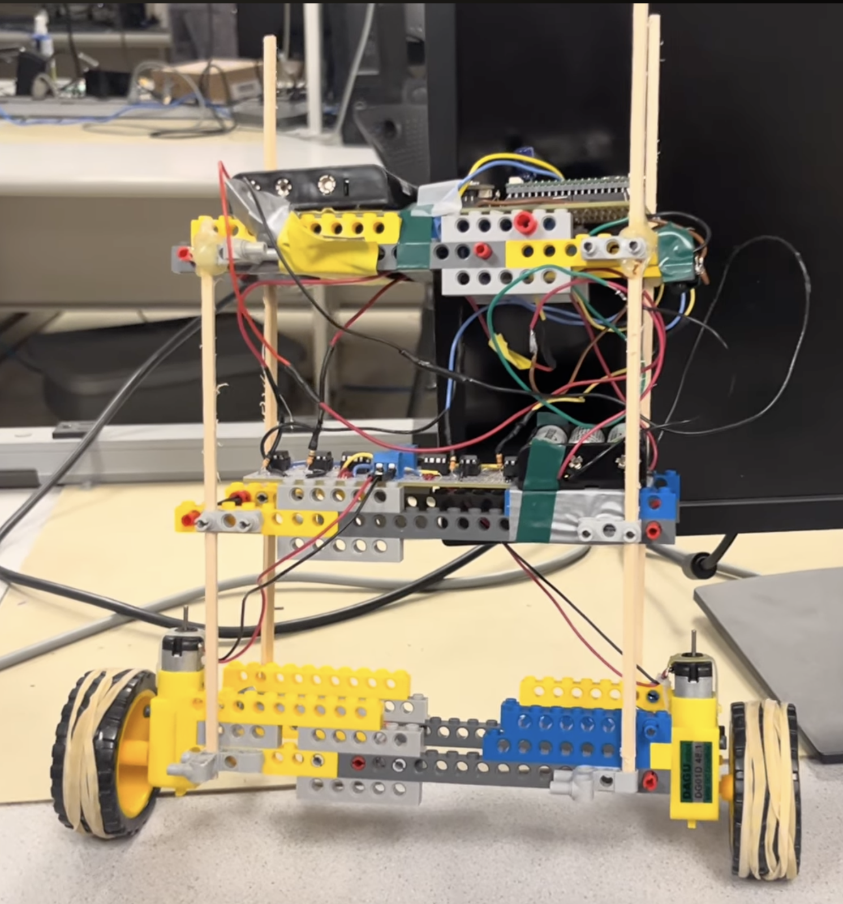

# Two-Wheel Self Balancing Robot

This is the codebase for a two-wheeled self-balancing robot which uses PID control to balance while moving forward and backwards. It was created for the final project for ECE 4760: Design with Microcontrollers by Jonathan Ma, Aidan Chan, and Ayushi Raina.

To see the robot in action, see the [YouTube video here](https://youtu.be/Jd0DRI0JFwQ)!

To see more information about the robot's design, see our webpage [here](https://ece4760.github.io/Projects/Fall2025/amc564_jjm498_ar929/FinalWebsite.html)!

